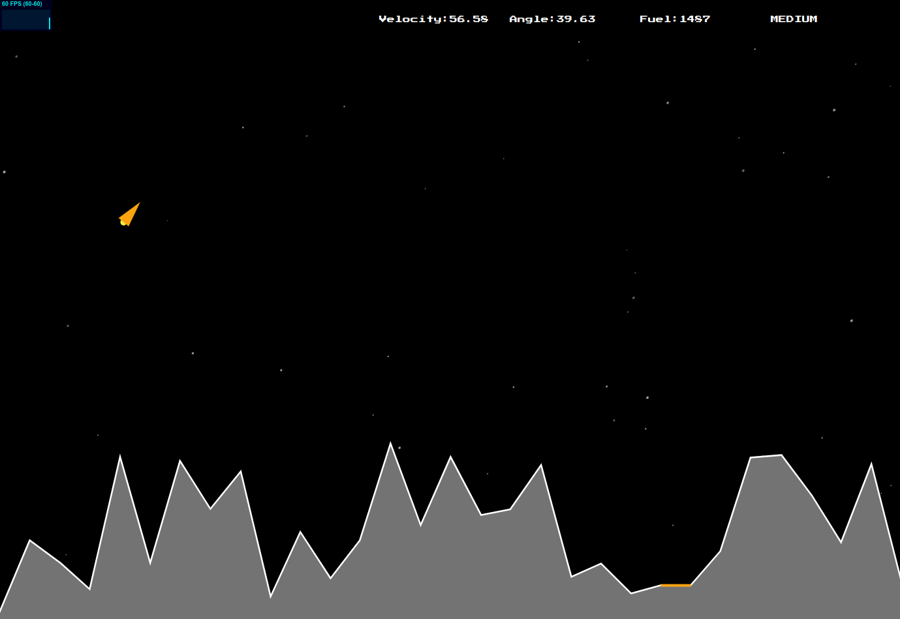

# Lunar Lander
A simple Lunar Lander game written in pure Javascript. Use the arrow keys to land the lander smoothly in the landing zone. Otherwise, you will crash! Keep in mind that you have a limited amount of fuel!

# Usage
Just download the files and open [index.html](index.html) in your browser.

# Features
* Proper physics models dealing with gravity, acceleration, angular drag, thrust direction, colliders, etc. Everything implemented from scratch.
* The lander only has a limited amount of fuel
* Map generation. Every time you play you get a new scenario!
* A succesfull landing depends on the velocity of the lander
* Particle explosion when crashing
* Three difficulty modes: easy, medium, hard.

# To Do
* Improve the landing method to detect also the landing angle (currently only takes into account the magnitude of the velocity)
* Improve the collider. Currenlty using a circle for the Lander
* Improve the map generator

# License
Released under the [MIT License](http://www.opensource.org/licenses/mit-license.php).